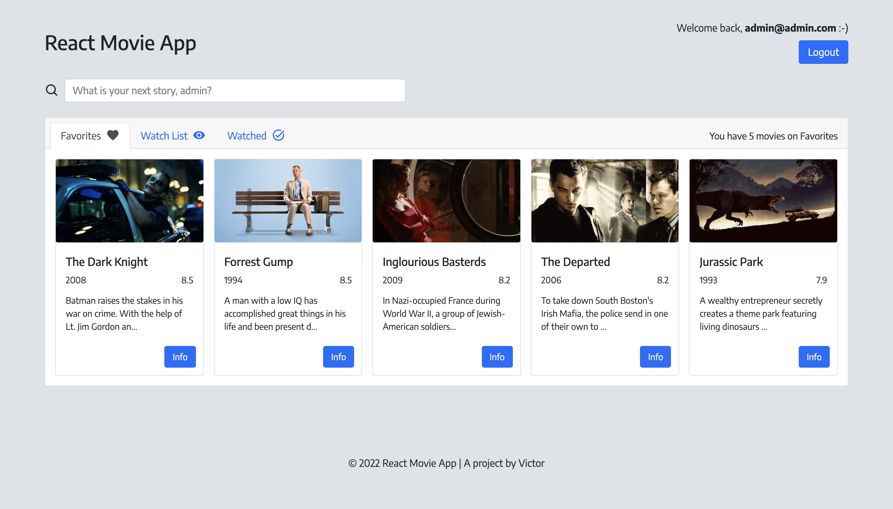

# React Movie App
https://victordrumond-movie-app.herokuapp.com/

## Technologies
`React` `React-Bootstrap` `Node.js` `Express.js` `Mongoose`

## Description
* A responsive app to organize movie collections in a simple and easy way.
* Built with React & Node.js. Using Bootstrap, Express, MongoDB Atlas and Mongoose.
* Search by movie title and get data for over 725,000 movies.
* Manage your movies in three different lists: Favorites, Watch List & Watched.

## Credits
* Movie API by [The Movie Database](https://www.themoviedb.org/).
* Database hosted on [MongoDB Atlas](https://www.mongodb.com/atlas).
* User authentication by [Auth0](https://auth0.com).
* Icons from [React Icons](https://react-icons.github.io/react-icons/).
* App running on Heroku. [Learn more](https://devcenter.heroku.com/articles/getting-started-with-nodejs).

## Screenshot


## Running Locally
In the project directory, you can run:

```
$ npm install
$ npm start
```

The server should now be running on [http://localhost:3001](http://localhost:3001).

After that, you can run:

```
$ cd ../client
$ npm install
$ npm start
```

The app should now be running on [http://localhost:3000](http://localhost:3000).

**Important**: You need to create two .env files to run this project locally. The first file must be in the project directory and should store the following variables:

`MONGO_URI=mongodb+srv://<username>:<password>@cluster0.uxh57.mongodb.net/<database>?retryWrites=true&w=majority`

This will connect the project to your MongoDB database. Be sure to change `<username>`, `<password>` and `<database>` to your own MongoDB information.

`TMDB_API_KEY=<key>`

This will be crucial to make API calls. Be sure to follow [these](https://www.themoviedb.org/documentation/api) steps to get a valid API `<key>` from The Movie Database.

The second .env file must be in the client folder and should store the following variables:

`REACT_APP_AUTH0_DOMAIN=<auth0-domain>`

`REACT_APP_AUTH0_CLIENT_ID=<auth0-client-id>`

These lines will connect the project to your Auth0 account. Be sure to change `<auth0-domain>` and `<auth0-client-id>` to your own Auth0 information.