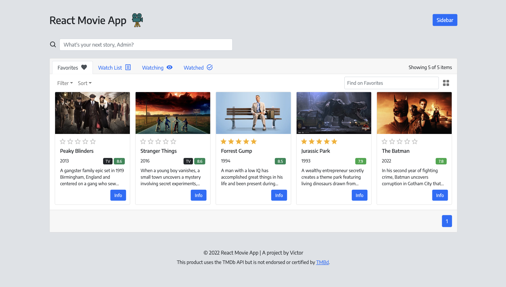

# React Movie App
https://victordrumond-movie-app.herokuapp.com/

## Technologies
`React-Bootstrap` `Node.js` `Express.js` `Mongoose`

## Description
* A responsive app to organize a collection of movies and TV shows in a simple and easy way.
* Built with React & Node.js. Using Bootstrap, Express, MongoDB Atlas and Mongoose.
* Search by title and get data for over 900,000 productions.
* Manage your saved items in four different lists: Favorites, Watch List, Watching & Watched.

## Credits
* Movie API by [The Movie Database](https://www.themoviedb.org/).
* Database hosted on [MongoDB Atlas](https://www.mongodb.com/atlas).
* User authentication by [Auth0](https://auth0.com).
* Icons from [React Icons](https://react-icons.github.io/react-icons/).
* App running on Heroku. [Learn more](https://devcenter.heroku.com/articles/getting-started-with-nodejs).

## Screenshots

